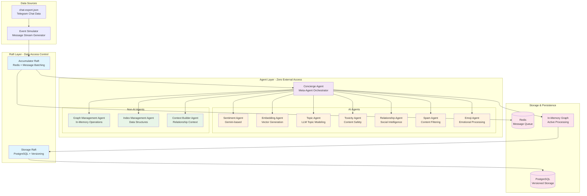
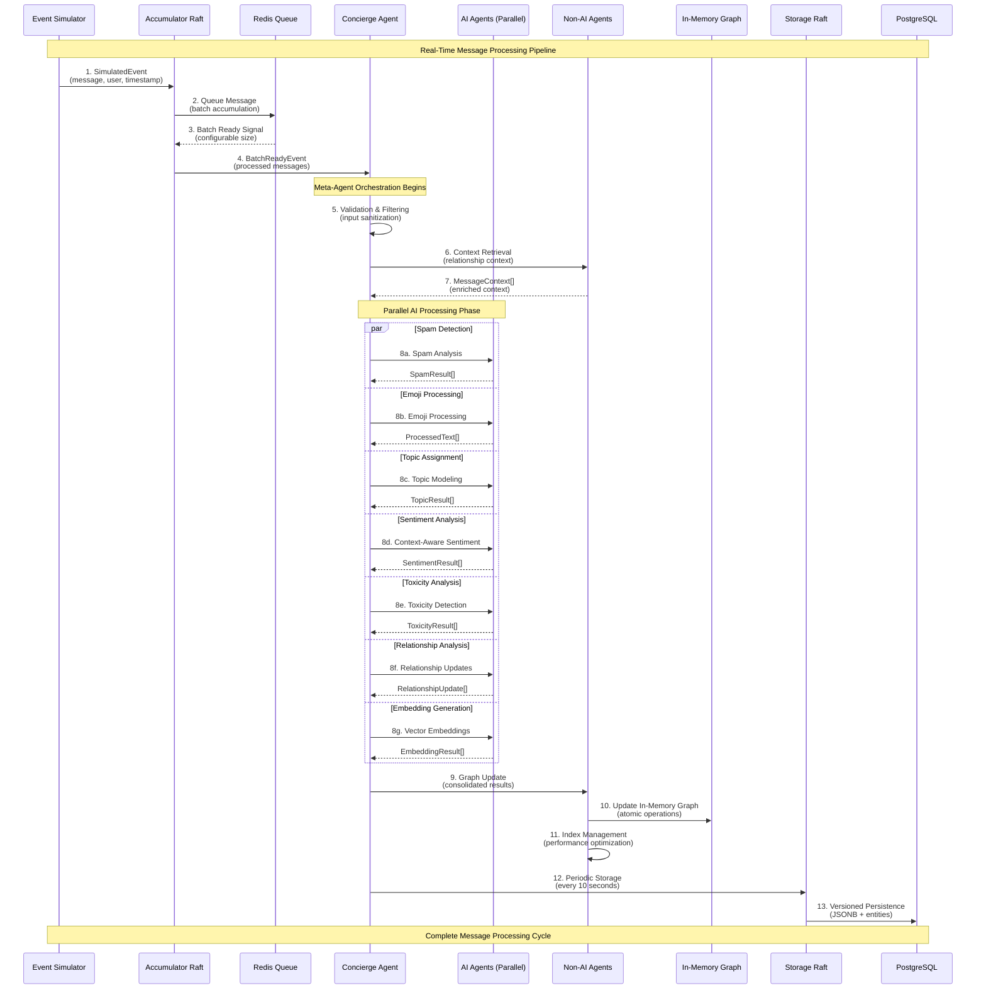
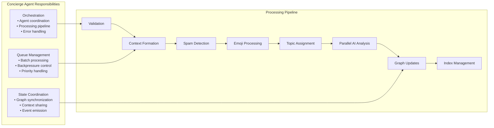
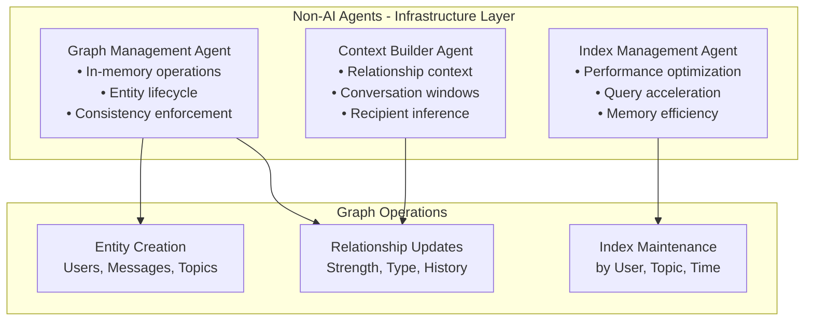
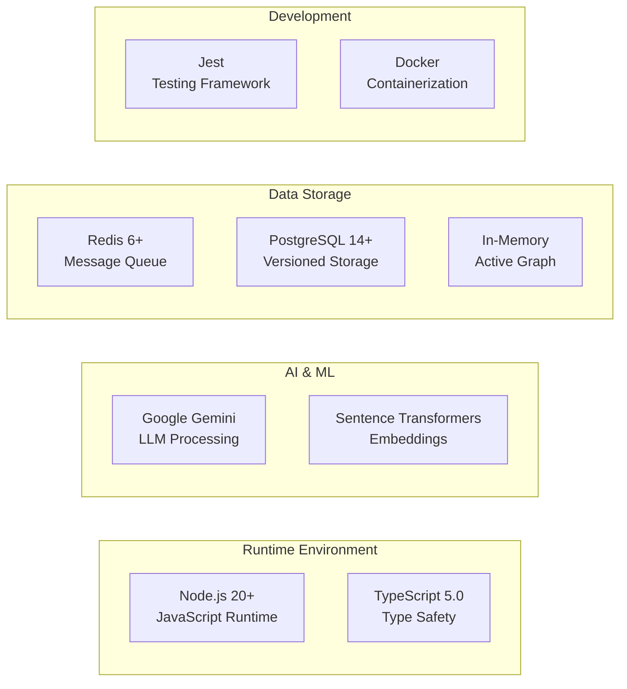
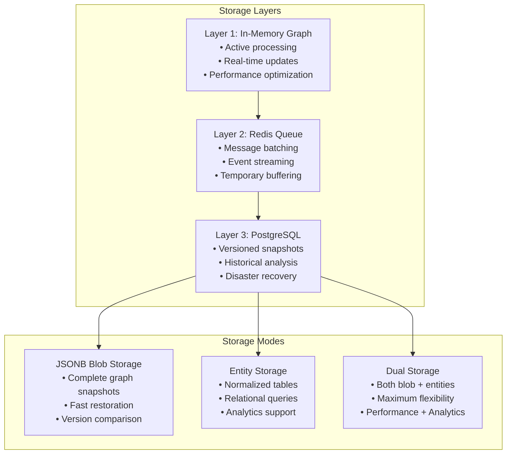
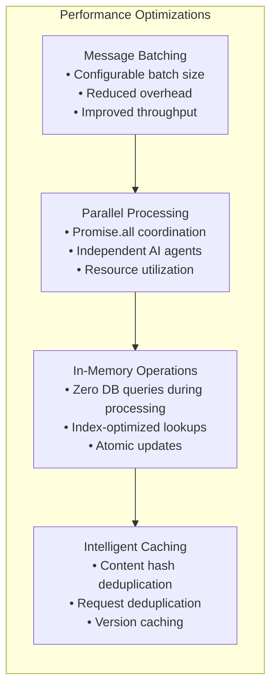
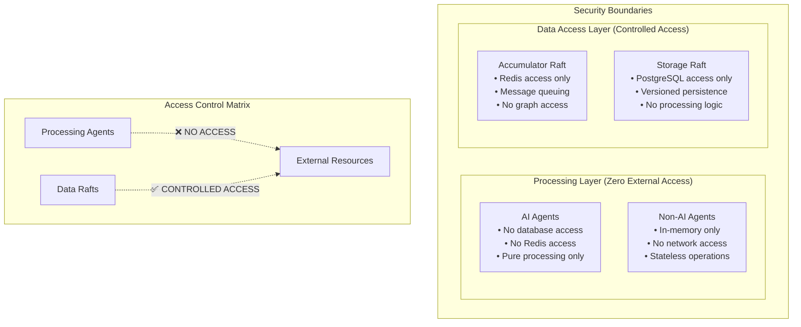
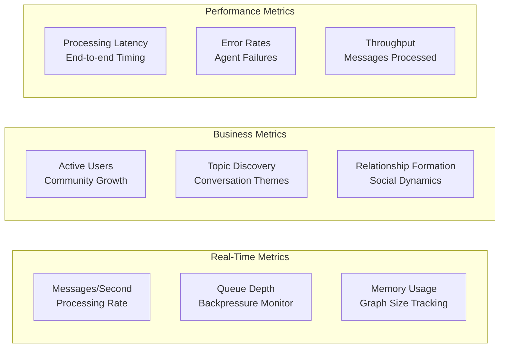
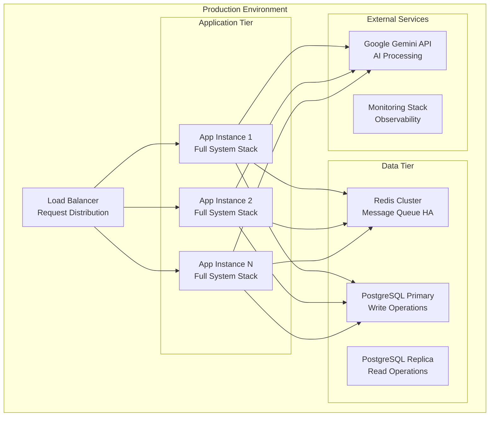

# Advanced Social Sentiment Analysis System - Complete Architecture Documentation

## 🏗️ System Overview

This is a **Level 5+ Agentic AI System** that processes real-time chat data to build living social graphs with relationship intelligence. The system transforms chaotic messaging data into deep social understanding through sophisticated multi-agent coordination.

### Core Mission
Transform conversations into actionable intelligence by building **living social graphs** that track relationships, understand context, and provide insights about community dynamics in real-time.

## 📊 High-Level Architecture Diagram



## 🔄 Detailed Data Flow Architecture



## 🧠 Agent Architecture Deep Dive

### Meta-Agent Coordination (Concierge Agent)



### AI Agent Specialization Matrix

| Agent | Purpose | Input | Output | Technology |
|-------|---------|-------|--------|------------|
| **Sentiment Agent** | Context-aware emotion analysis | Text + Relationship Context | Sentiment scores with relationship influence | Google Gemini |
| **Embedding Agent** | Vector space representation | Processed text | 384-dimensional embeddings | Sentence Transformers |
| **Topic Agent** | Intelligent topic classification | Text + Existing topics + Context | Topic assignments with confidence | Google Gemini |
| **Toxicity Agent** | Context-aware safety analysis | Text + User relationships | Toxicity scores considering relationships | Google Gemini |
| **Relationship Agent** | Social dynamics tracking | Message patterns + User interactions | Relationship strength updates | Google Gemini |
| **Spam Agent** | Context-aware content filtering | Text + User history | Spam probability with context | Google Gemini |
| **Emoji Agent** | Emotional context extraction | Raw text with emojis | Processed text + emotional metadata | Google Gemini |

### Non-AI Agent Infrastructure



## 🏛️ Data Architecture

### In-Memory Graph Structure

```typescript
interface InMemoryGraph {
    // Core Entities
    messages: Map<number, Message>           // All processed messages
    users: Map<number, User>                 // User profiles & activity
    topics: Map<number, Topic>               // Dynamic topic taxonomy
    conversations: Map<string, Conversation> // Thread tracking
    userRelationships: Map<string, UserRelationship> // Social graph
    conversationContexts: Map<string, ConversationContextWindow> // Context windows

    // Performance Indexes
    messagesByUser: Map<number, number[]>     // User→Messages lookup
    messagesByTopic: Map<number, number[]>    // Topic→Messages lookup
    activeConversations: Map<number, string[]> // User→Active threads
    relationshipsByUser: Map<number, Set<string>> // User→Relationships
    
    // Metadata & Stats
    stats: GraphStatistics
    groupId: number
}
```

### Message Processing Data Structures

```typescript
interface MessageContext {
    messageId: number
    senderId: number
    recipientIds: number[]
    userRelationship?: UserRelationship
    conversationContext?: ConversationWindow
    topicContext?: number[]
    senderName?: string
    recipientNames?: string[]
}

interface ProcessingResults {
    embeddings: number[][]              // Vector representations
    sentimentResults: SentimentResult[] // Context-aware emotions
    toxicityResults: ToxicityResult[]   // Safety analysis
    topicResults: TopicResult[]         // Topic assignments
    relationshipUpdates: RelationshipUpdate[] // Social graph changes
}
```

## 🔧 Technology Stack Deep Dive

### Core Technologies



### Storage Strategy - Multi-Layered Persistence



## ⚡ Performance Architecture

### Processing Pipeline Optimization



### Scalability Considerations

| Component | Scaling Strategy | Bottleneck | Solution |
|-----------|------------------|------------|----------|
| **Event Simulator** | Horizontal (multiple instances) | I/O throughput | Async processing + batching |
| **Accumulator Raft** | Vertical (Redis scaling) | Memory capacity | Redis clustering + sharding |
| **Concierge Agent** | Horizontal (agent pools) | CPU utilization | Process-level parallelization |
| **AI Agents** | Horizontal (API scaling) | API rate limits | Request pooling + backoff |
| **Storage Raft** | Vertical (PostgreSQL) | Write throughput | Connection pooling + batching |

## 🔒 Security & Access Control

### Agent Isolation Architecture



### Data Privacy & Isolation

- **Stateless Agent Design**: All AI agents are stateless and cannot persist data
- **Access Control Boundaries**: Clear separation between processing and storage
- **Content Hashing**: Idempotent operations prevent duplicate processing
- **Versioned Storage**: Complete audit trail with rollback capabilities

## 📈 Monitoring & Observability

### System Health Metrics



### Error Handling & Recovery

- **Graceful Degradation**: System continues operating with reduced functionality
- **Retry Logic**: Exponential backoff for transient failures
- **Circuit Breakers**: Prevent cascade failures in AI agents
- **State Recovery**: In-memory graph restoration from versioned storage

## 🚀 Deployment Architecture

### Production Deployment Strategy



## 🔧 Configuration & Environment

### Environment Variables
```bash
# Database Configuration
POSTGRES_HOST=localhost
POSTGRES_PORT=5432
POSTGRES_DB=topic_modeling
POSTGRES_USER=postgres
POSTGRES_PASSWORD=password

# Redis Configuration
REDIS_HOST=localhost
REDIS_PORT=6379

# AI Configuration
GEMINI_API_KEY=your_api_key_here
GEMINI_MODEL=gemini-1.5-flash

# Processing Configuration
BATCH_SIZE=5
SIMILARITY_THRESHOLD=0.7
OPTIMIZATION_INTERVAL=10000
```

### System Requirements

| Component | Minimum | Recommended | Production |
|-----------|---------|-------------|------------|
| **CPU** | 2 cores | 4 cores | 8+ cores |
| **Memory** | 4GB RAM | 8GB RAM | 16+ GB RAM |
| **Storage** | 10GB SSD | 50GB SSD | 500+ GB SSD |
| **Network** | 100 Mbps | 1 Gbps | 10+ Gbps |

This architecture represents a sophisticated, production-ready system that combines cutting-edge AI processing with robust engineering practices, making it ideal for real-world social intelligence applications.
